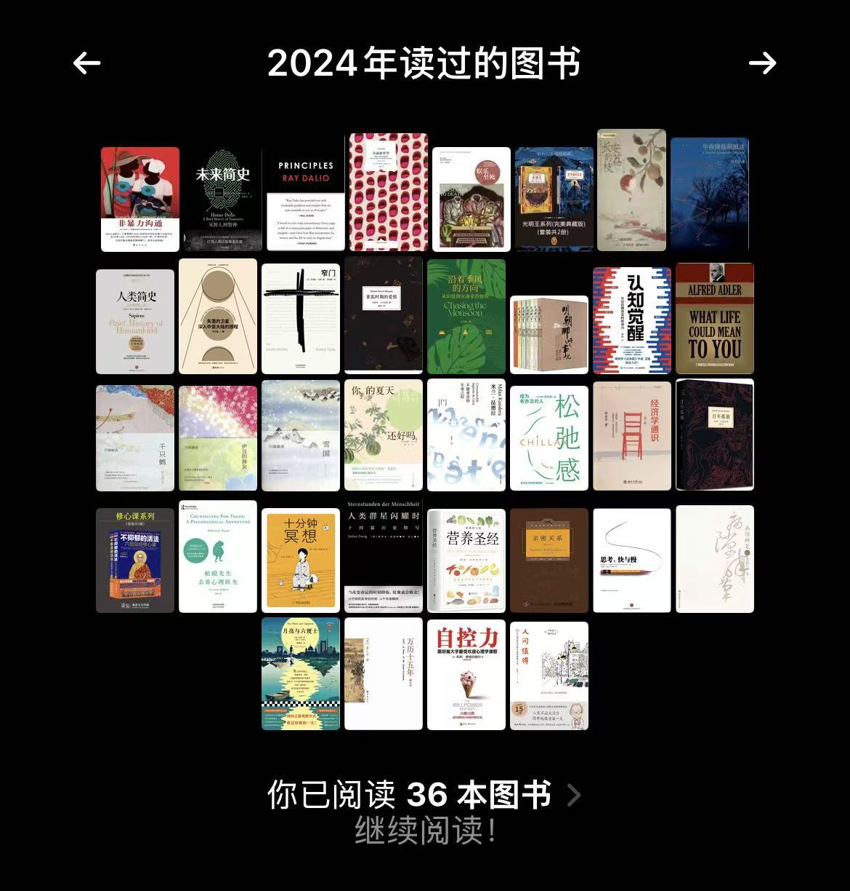
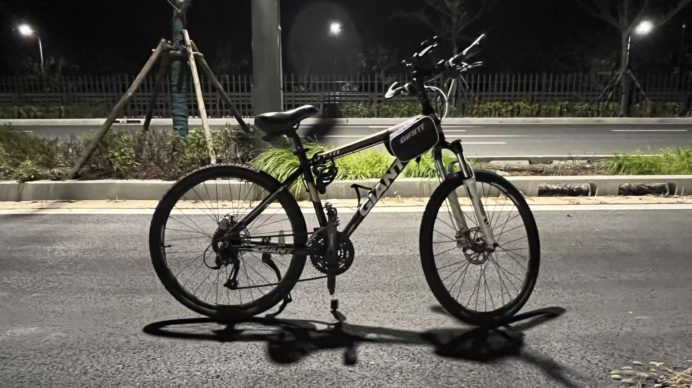
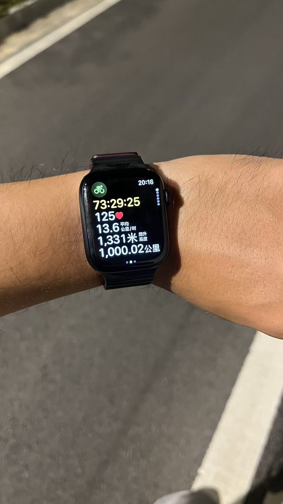

<h1 align="center"> Hi there ， I'm Cao Hao 👋</h1>

## 📔 𝙰𝚋𝚘𝚞𝚝 𝙼𝚎
- 🎂 Birth : 1997
- 🐉 Nationality : China
- 🖥️ Job : Software Developer with 6 year full-time job experience
- 🧠 My dream is to become a excellent engineer , to do so , keep learning now .

---
## 📫 How To Reach Me
- 
- 
- 

---
## ❤️ Habbit
#### 📖 Reading : 
> 2025Y : 31 Books ; 2024Y : 36 Books  
> If you have ever read the same book with me , glad to discuss ~  
>   

#### 🚴 Cycling : 
> My proudest record is cycling continuously for a week, covering a total distance of approximately 1000 kilometers.  
>   

---
## 🖥️ Skills
#### 🌐 Web
|  name   | level  |
|  :---:  | :---:  |
| html , css , js  | ⭐⭐⭐ |
| vue  | ⭐⭐ |

#### 🗿 Backend
|  name   | level  |
|  :---:  | :---:  |
| c#   | ⭐⭐⭐⭐ |
| Java  | ⭐⭐ |
| Python  | ⭐⭐ |
| nodejs  | ⭐⭐ |

#### 🔗 Web3 (Recent Learning ...)
|  name   | level  |
|  :---:  | :---:  |
| Solidity  | ⭐ |
| Foundry  | ⭐ |

#### 🤖 AI (Recent Learning ...)
|  name   | level  |
|  :---:  | :---:  |
| ComfyUI  | ⭐ |

## Github Stats
